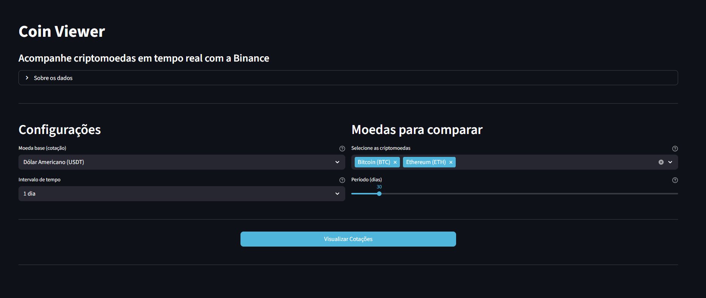

# Coin Viewer

Interactive web app for real-time cryptocurrency price visualization using the public Binance API.

---

## Technologies


---

## About

Coin Viewer connects to the public Binance API to display historical and live price data for the most traded cryptocurrencies. No API credentials are required for basic usage.



**Key features:**

- Compare multiple coins (BTC, ETH, BNB, XRP, ADA, SOL and more)
- Choose quote currency: USDT, BTC, ETH, or BUSD
- Select time intervals: 1h, 4h, or 1d
- Analyze up to 365 days of historical data
- Interactive Plotly charts with zoom, pan, and hover
- Real-time price and percentage change statistics

---

## Installation

```bash
pip install -r requirements.txt
streamlit run main.py
```

The app opens automatically at `http://localhost:8501`.

**Optional — Binance API keys** (for higher rate limits):

Create a `.env` file with:

```env
API_KEY=your_api_key
API_SECRET=your_api_secret
```

> Enable read-only permissions only. Never enable trading access.

---

## License

This project is licensed under the MIT License.

---

## Contact

[](https://www.linkedin.com/in/diogo-oike-kanefuku-23639b223/) 
[](mailto:diogooikejapan@gmail.com)
